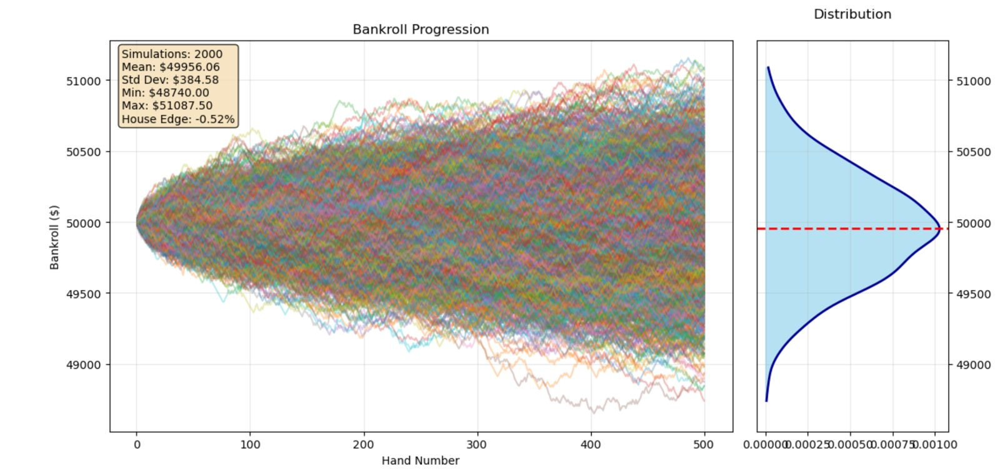
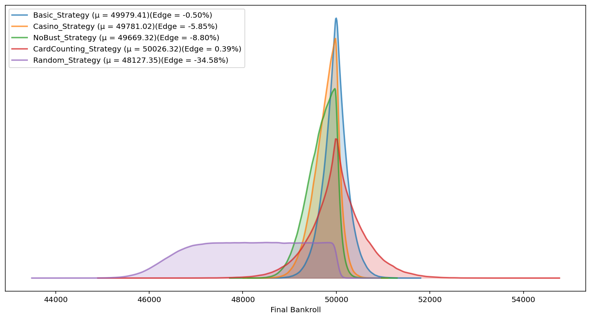
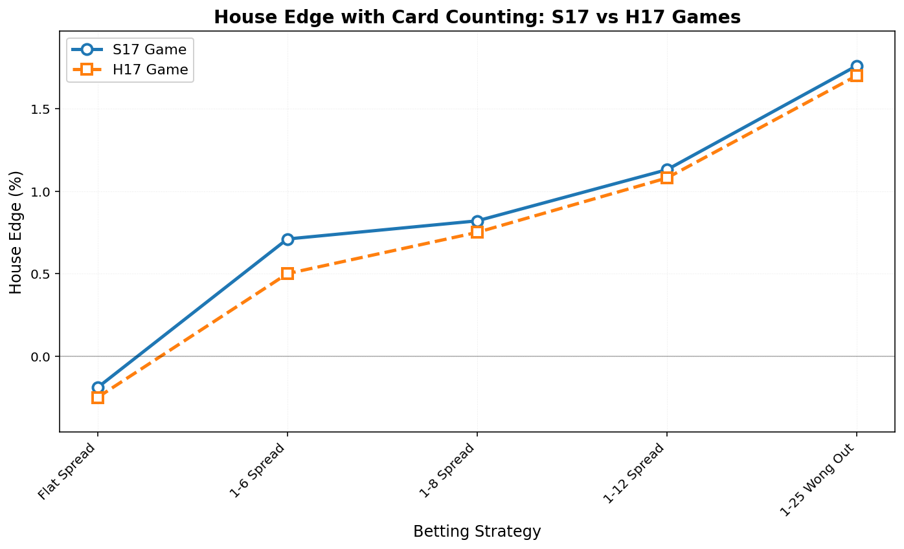
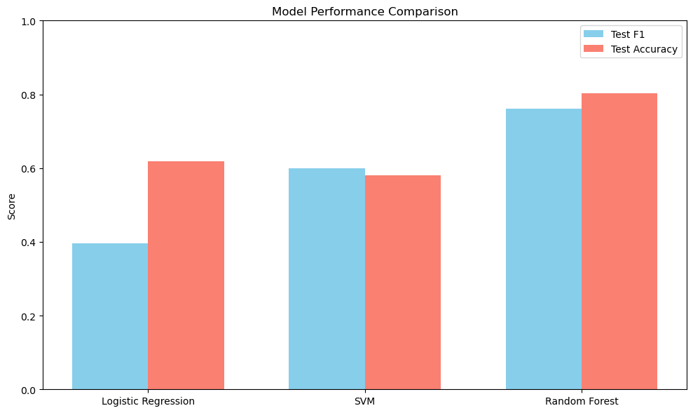
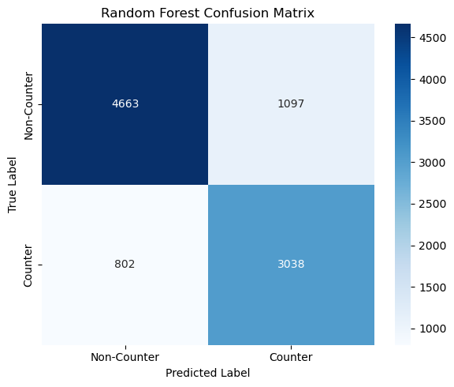

# Blackjack Simulation 🃏


*"The house edge is just the cost of entertainment... unless you know how to count cards."* 🃏

A Python-based simulation framework for analyzing **Blackjack strategies, betting systems, and card counting detection** using **Monte Carlo simulations** and **machine learning models**.

This project was developed as part of *ACM40960 — Projects in Maths Modelling* at University College Dublin.

## Repository Structure

```
Blackjack_Simulation/
├── Blackjack/                        # Source code
│   ├── Betting.py                    # Betting strategy implementations
│   ├── Card.py                       # Card class and properties
│   ├── Count.py                      # Card counting logic
│   ├── Dealer.py                     # Dealer behavior and actions
│   ├── Deck.py                       # Deck management and shuffling
│   ├── Hand.py                       # Hand evaluation and status
│   ├── HouseRules.py                 # Configurable game rules
│   ├── Player.py                     # Player decision logic
│   ├── Plotting.py                   # Visualization tools
│   ├── Simulation.py                 # Batch simulation runner
│   └── Strategy.py                   # Player strategies
│   └── SimulationNotebook.ipynb      # Monte Carlo Simulation of BlackJack
├── Images/                           # Visualization outputs
├── Datasets/                         # Analysis datasets
├── Poster/                           # Academic poster
├── Card Counting Detection.ipynb     # Detailed analysis notebook
├── requirements.txt                  # Python dependencies
├── LICENSE                           # MIT License
└── README.md                         # This file
```

## Table of Contents

1. [Abstract](#abstract)
2. [Blackjack Overview](#blackjack-overview)
3. [Project Overview](#project-overview)
4. [Key Features](#key-features)
5. [Installation](#installation)
6. [Usage Examples](#usage-examples)
7. [Game Components](#game-components)
8. [Analysis & Visualization](#analysis--visualization)
9. [Monte Carlo Simulation Notebook Explainer](#monte-carlo-simulation-notebook-explainer)
10. [Research Results](#research-results)
11. [Contributing](#contributing)
12. [Academic Reference](#academic-reference)
13. [License](#license)
14. [References](#references)

## Abstract

Blackjack is one of the most mathematically rich casino games, where optimal play and strategy can significantly influence long-term outcomes. This project explores the balance between **player advantage strategies** (e.g., card counting) and **casino countermeasures** through large-scale simulations and statistical modeling.

Our study focuses on:
- Simulating **real casino Blackjack rules**.
- Evaluating the **effectiveness of strategies** like basic play, no-bust, random play, and card counting.
- Analyzing **betting spreads** and **rule variations** (e.g., decks used, payouts, dealer actions).
- Developing **machine learning models** to detect card counters based on gameplay data.

## Blackjack Overview
### Game Overview
Blackjack is a popular casino card game where players aim to beat the dealer by getting cards totalling closer
to 21 without going over (called "busting").

**Card Totals:**
- Number cards (2-10): Face value
- Face cards (Jack, Queen, King): Worth 10 points
- Ace: Worth 1 or 11 (whichever is better)

**Gameplay:**
Each player receives two cards initially, as does the dealer (one face-up, one face-down). Players
can "hit" (take another card) or "stand" (keep current total). Other options include "double down" (double
bet, take one more card) or "split" (separate identical cards into two hands).

**Winning:**
- Get 21 with first two cards (Natural Blackjack)
- Get closer to 21 than dealer without busting
- Dealer busts whilst you don’t

### Player Actions

- **Hit:** Draw another card from the deck to add to your hand total. You can hit multiple times until you either stand, double down, or bust (exceed 21).

- **Stand:** Keep your current hand total and end your turn without drawing any additional cards. Play then moves to the next player or the dealer.

- **Double Down:** Double your original bet and receive exactly one more card, after which you must stand. This action is only available on your first two cards (or sometimes after splitting).

- **Split:** When dealt two cards of the same rank, you can split them into two separate hands by placing an additional bet equal to your original wager. Each hand is then played independently, starting with one additional card dealt to each.

- **Surrender:** Forfeit half of your bet and give up your hand without playing it out. This option is typically only available on your first two cards and before taking any other action. Not all casinos offer surrender.

- **Insurance:** When the dealer's up card is an Ace, you can place a side bet (up to half your original bet) that the dealer has blackjack. If the dealer has blackjack, insurance pays 2:1; otherwise, you lose the insurance bet and the hand continues normally.

### House Edge

House edge represents the mathematical advantage the casino holds over players in blackjack, expressed as a percentage of each bet. With basic strategy, the house edge typically ranges from 0.5% to 1%, meaning the casino expects to win 50 cent to $1 for every $100 wagered over time.

### Basic Strategy
Basic strategy is a mathematically-derived set of playing decisions that minimises the house edge in blackjack. It tells players the statistically optimal action (hit, stand, double, split, or surrender) for every possible combination of player hand and dealer up card. Developed through computer analysis of millions of hands, basic strategy reduces the house edge to approximately 0.5% when followed perfectly. The strategy varies slightly depending on specific game rules and number of decks used.

### Card Counting
Card counting is a legal strategy that tracks the ratio of high cards (10s, face cards, Aces) to low cards (2-6) remaining in the deck. When more high cards remain, players have a statistical advantage and should increase their bets. The most common system assigns values to cards (+1 for low cards, -1 for high cards) to maintain a running count. Whilst not illegal, casinos ban suspected counters and use countermeasures like frequent shuffling and multiple decks to reduce effectiveness.

### Rule Variations
There are many different variations of blackjack depending on how the casino sets the rules. Some common rules that vary include:

- **S17/H17:** This indicates how the dealer plays. For S17, the dealer will stand if they receive a soft 17 or higher (hand with an ace equal to 17 or higher). They will also stand on any hard 17 or higher. If the rule is H17, the dealer will only stand when they receive a hard 17 or higher.
- **Double after Split (DAS):** If allowed, players can double on a split hand.
- **Late Surrender (LS):** If allowed, players can surrender their hand after seeing the dealer's up card.
- **Natural Blackjack Payout:** Most casinos offer a 3:2 payout when a player hits a natural blackjack (two card hand equal to 21). However, some casinos have recently started to offer a 6:5 payout. Some don't even offer an additional payout, only paying 1:1.

## Project Overview

This simulation framework provides a comprehensive environment for analyzing Blackjack strategies, betting systems, and detection mechanisms. The project combines mathematical modeling with machine learning to understand both player and casino perspectives in the game of Blackjack.

The simulation engine runs millions of hands using Monte Carlo methods to generate statistically significant results across different game configurations and player strategies.

## Key Features

- **Blackjack Simulator**: Implements casino rules with configurable game settings
- **Monte Carlo Engine**: Runs millions of simulated hands to measure statistical outcomes
- **Strategy Comparison**: Evaluates player performance under different strategies
- **Betting Analysis**: Tests flat betting vs. progressive betting spreads
- **Rule Variations**: Examines how changes (deck count, S17/H17, 6:5 payouts, etc.) impact the house edge
- **ML Counter Detection**: Random Forest, Logistic Regression, and SVM models to identify card counters
- **Data Visualization**: Generates plots for bankroll distributions, house edge, and model performance

## Installation

### Prerequisites

```bash
# Check Python version (3.8+ required)
python --version

# Ensure pip is installed
pip --version
```

### Quick Install

```bash
# Clone the repository
git clone https://github.com/ACM40960/project-sean-deergh-blackjack-project

# Create virtual environment
python -m venv blackjack_env

# Activate virtual environment
# On macOS/Linux:
source blackjack_env/bin/activate
# On Windows:
blackjack_env\Scripts\activate

# Install dependencies
pip install -r requirements.txt
```

### Dependencies

```
numpy>=1.21.0
pandas>=1.3.0
matplotlib>=3.4.0
seaborn>=0.11.0
jupyter>=1.0.0
scipy>=1.7.0
```

## Usage Examples

### Counting Card Analysis

```bash
# Launch Jupyter and open the analysis notebook
jupyter notebook
# Navigate to 'Card Counting Detection.ipynb'
```

### Monte Carlo Simulation

```bash
cd Blackjack
# Launch Jupyter and open the analysis notebook
jupyter notebook
# Navigate to 'SimulationNotebook.ipynb'
```

## Game Components

The simulation implements the following core components:

- **Card & Deck Management**: Realistic card dealing and shuffling
- **Player Strategies**: Basic strategy, card counting, random play, and no-bust
- **Dealer Logic**: Standard casino dealer rules and behaviors
- **Betting Systems**: Flat betting and various spread betting strategies
- **House Rules**: Configurable game variations and rule sets

## Analysis & Visualization

The framework provides comprehensive visualization tools for:

- **Bankroll distributions across strategies**
- **House edge by rule variations**  
- **Confusion matrix for card counter detection**
- **Strategy performance metrics**
- **Betting system effectiveness**

## Monte Carlo Simulation Notebook Explainer

`SimulationNotebook.ipynb` runs a Monte Carlo simulation of blackjack games with fully customizable settings. You can adjust **house rules** (e.g., dealer stands on soft 17, blackjack payout, number of decks), choose different **player strategies** (basic strategy, casino play, no-bust, random), enable **card counting**, and apply different **betting spreads** (flat, progressive, or wonging out). Players are configured with an initial bankroll and strategy accuracy, and simulations can be run over many trials and hands to analyze long-term outcomes.  

By modifying the rule parameters, strategy class, betting spread, or simulation settings, you can test how different conditions impact profitability.

After running the notebook, one can expect the outputted graph shown below. This shows the player's bankroll for each trial as well as the distribution of the player's final bankroll at the end of each trial.




## Research Results

The following result for the balckjack simulation were achieved under the follwoing ruleset: H17, DAS offered, LS offered, 8 decks, 4 deck penetration, 3:2 blackjack payout and minimum bet of $15.

### Strategy Performance



- **Card counting**: Only profitable strategy → **+0.39% player edge**
- **Basic strategy**: **-0.50% player edge**
- **Random strategy**: **-34.58% player edge** (worst performance)

### Betting Strategies



- **Flat betting**: Negative returns even with card counting
- **Spread betting**: Increases profitability; *1-25 Wong Out spread* yields **+1.76% player edge** in S17 games. It is expected that this bet spread performs the best as when in use, the player does not bet when the count is negative which is when the casino has the highest edge.
- As can be seen, the more aggresive the bet spread, the higher the player's edge is. However, this will make the player more susceptible to being caught card counting by the casino.

### Rule Impact
The table below shows how various rules affect the player's edge:

<table>
<tr style="border-bottom: 1.2px solid #fff;"><td>Basic Strategy</td><td>-0.55%</td></tr>
<tr style="border-bottom: 1.2px solid #fff;"><td><strong>Rule Change</strong></td><td><strong>Difference</strong></td></tr>
<tr><td>1 Deck</td><td>+0.5%</td></tr>
<tr><td>2 Decks</td><td>+0.3%</td></tr>
<tr><td>4 Decks</td><td>+0.08%</td></tr>
<tr><td>6 Decks</td><td>+0.02%</td></tr>
<tr><td>Stand Soft 17</td><td>+0.18%</td></tr>
<tr><td>No Double After Split</td><td>-0.03%</td></tr>
<tr><td>No Late Surrender</td><td>-0.03%</td></tr>
<tr><td>6:5 Blackjack Payout</td><td>-1.18%</td></tr>
</table>

- More decks improve the house edge
- Favorable rules (e.g., Stand on Soft 17) slightly help players
- Harsh rules (e.g., 6:5 payout) strongly favor the house (-1.18%)

### Variance

- Even with an edge, **short-term variance dominates**
- Simulation of 5M hands: wide confidence intervals show need for bankroll management and long-term play

### Machine Learning Detection



- **Random Forest** best at detecting card counters:
  - **F1 score:** 0.76
  - **Accuracy:** 0.80
- **Most predictive features**: Bet size, true count, player value, dealer upcard
- **Random Forest Confusion Matrix**: With high accuracy it can verified, whether a player is counting cards or not.



## Academic Reference

### Research Poster

For a comprehensive overview of the research methodology and findings, see our academic poster:

📄 **[View Research Poster](Poster/Poster_Presentation.pdf)**

The poster covers:
- Mathematical foundations of Blackjack
- Simulation methodology
- Statistical analysis results
- Practical implications for players

### Authors

- **Seán Houraghan** (24209056), *MSc Data and Computational Science (2024-25)*
- **Deergh Kataria** (24218299), *MSc Data and Computational Science (2024-25)*

University College Dublin, School of Mathematics

## License

This project is licensed under the MIT License. See the [LICENSE](LICENSE) file for details.

## References

The following GitHub repository provided inspiration for the structure of the simulator in this repository:
https://github.com/jgayda/blackjack-simulator/tree/main

The following website was used to verify our simulator was producing correct house edge results for different strategies:
https://wizardofodds.com/games/blackjack/calculator/

Basic Strategy Charts and Counting Deviations were found here:
https://www.blackjackapprenticeship.com/blackjack-strategy-charts/

---
